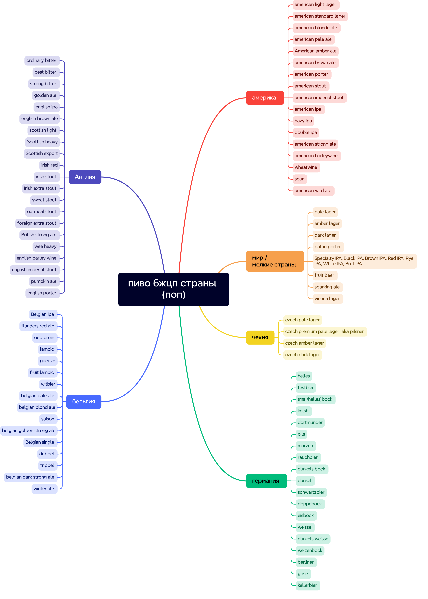

# beer-board

## Стили

### америка

- american light lager
- american standard lager
- american blonde ale
- american pale ale
- American amber ale
- american brown ale
- american porter
- american stout
- american imperial stout
- american ipa
- hazy ipa
- double ipa
- american strong ale
- american barleywine
- wheatwine
- sour
- american wild ale

### мир / мелкие страны

- pale lager
- amber lager
- dark lager
- baltic porter
- Specialty IPA: Black IPA, Brown IPA, Red IPA, Rye IPA, White IPA, Brut IPA
- fruit beer
- sparking ale
- vienna lager

### чехия

- czech pale lager
- czech premium pale lager aka pilsner
- czech amber lager
- czech dark lager

### германия

- helles
- festbier
- (mai/helles)bock
- kolsh
- dortmunder
- pils
- marzen
- rauchbier
- dunkels bock
- dunkel
- schwartzbier
- doppebock
- eisbock
- weisse
- dunkels weisse
- weizenbock
- berliner
- gose
- kellerbier

### бельгия

- Belgian ipa
- flanders red ale
- oud bruin
- lambic
- gueuze
- fruit lambic
- witbier
- belgian pale ale
- belgian blond ale
- saison
- belgian golden strong ale
- Belgian single
- dubbel
- trippel
- belgian dark strong ale
- winter ale

### Англия

- ordinary bitter
- best bitter
- strong bitter
- golden ale
- english ipa
- english brown ale
- scottish light
- Scottish heavy
- Scottish export
- irish red
- irish stout
- irish extra stout
- sweet stout
- oatmeal stout
- foreign extra stout
- British strong ale
- wee heavy
- english barley wine
- english imperial stout
- pumpkin ale
- english porter