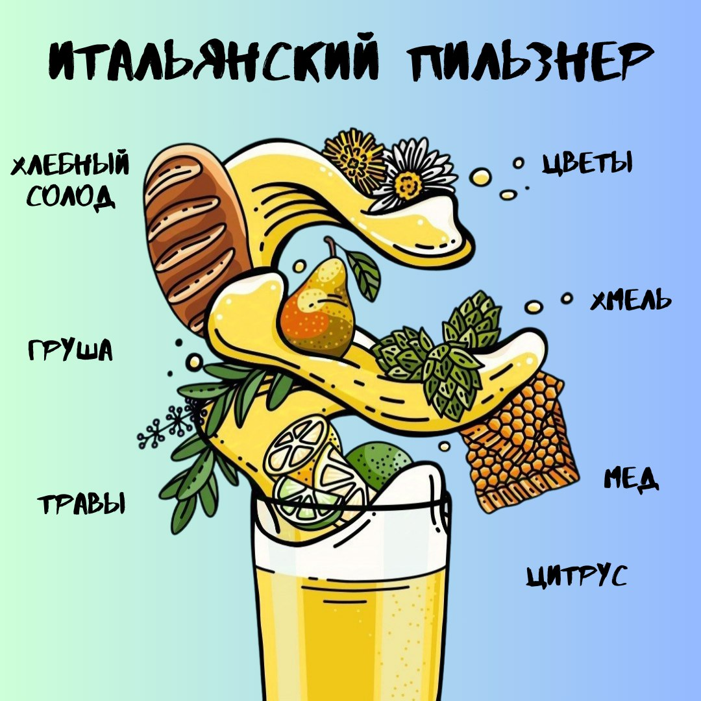

# Пилзнер / Pilsner

## Описание

Оригинально чешский, хмельной, освежающий, хрустящий лагерок

| Характеристика | Спектр                                                      |
|----------------|-------------------------------------------------------------|
| Цвет           | Золотой, прозрачный                                         |
| Пена           | Много                                                       |
| Карбо          | Высокое                                                     |
| Запах          | Цветы, фрукты, цитрусы, хмель, хлебушек, тост               |
| Вкус           | Освежающий, горьковатый, балансирующая **медовая** сладость |
| Mouthfeel      | От лёгкой до средней                                        |
| Финиш          | Сухой, травянистый, пв от короткого до продолжительного     |

### Хрустящий

- **Прозрачность:** Пиво имеет кристально чистый, прозрачный вид без мутности
- **Карбонизация:** Высокий уровень карбонизации создает ощущение "хрусткости" или свежести во рту
- **Сухость:**  Финиш пива сухой и четкий, без остаточной сладости, что усиливает ощущение "хрусткости"
- **Освежающий характер:** Легкое, чистое и освежающее послевкусие, которое часто ассоциируется с "хрустящим" ощущением
- **Хмелевая горечь:** Выраженная, но сбалансированная горечь, которая придает пиву четкость и "хрусткость" вкуса
- **Легкость тела:** Пиво имеет легкое или средне-легкое тело, что способствует ощущению "хрусткости"

## Примеры

- [Pilsner Urquell](https://untappd.com/b/plzensky-prazdroj-pilsner-urquell/37936)
- [Zubr Gold](https://untappd.com/b/pivovar-zubr-zubr-gold/64178)
- [Velka Morava — Moravský Klas Světlé](https://untappd.com/b/velka-morava-moravsky-klas-svetle-moravskij-klass-svetloe/302027)

## Вариации

| Pilsner     | Хмель (запах)   | Плотность (не легкость) | Горечь       | Сладость                   | Финиш (сухость) |
|-------------|-----------------|----------------------------|--------------|----------------------------|-----------------|
| Czech       | ➕➕➕ Цветочки | ➕➕➕                        | ➕➕➕ Трава | ➕➕➕ Мед, карамель, тост | ➕➕              |
| German      | ➕➕              | ➕➕                         | ➕➕           | ➕➕                         | ➕➕➕             |
| Italian     | ➕ Фрукты     | ➕                          | ➕            | ➕➕➕                        | ➕               |
| New Zealand | ➕➕➕ Фрукты   | ➕➕                         | ➕➕➕          | ➕➕                         | ➕➕➕             |

### German Pilsner

Если хочется посуше

**Примеры**

- [Radeberger Pilsner](https://untappd.com/b/radeberger-gruppe-radeberger-pilsner/1589)
- [Bitburger Premium Pils](https://untappd.com/b/bitburger-brauerei-bitburger-premium-pils/17252)
- [Хамовники Пильзенское](https://untappd.com/b/moscow-brewing-company-moskovskaya-pivovarennaya-kompaniya-hamovniki-pilzenskoe-hamovniki-pilzenskoe/233021)

### Italian Pilsner

{ width="500" }

Если хочется полегче

**Примеры**

[Mitra — Кукбка²](https://untappd.com/b/mitra-brewing-co-kukbka2/5382980)

### New Zealand Pilsner

Если хочется крафтовых хмелей

**Примеры**

- [Mitra — Уважаемые соседи,](https://untappd.com//b/mitra-brewing-co-uvazhaemye-sosedi/5504742)

## Дефекты

- _Мыло_ - переварили
- _Кукуруза_ = диметилсульфид (DMS)
- _Землянистость_ - старое сырье
